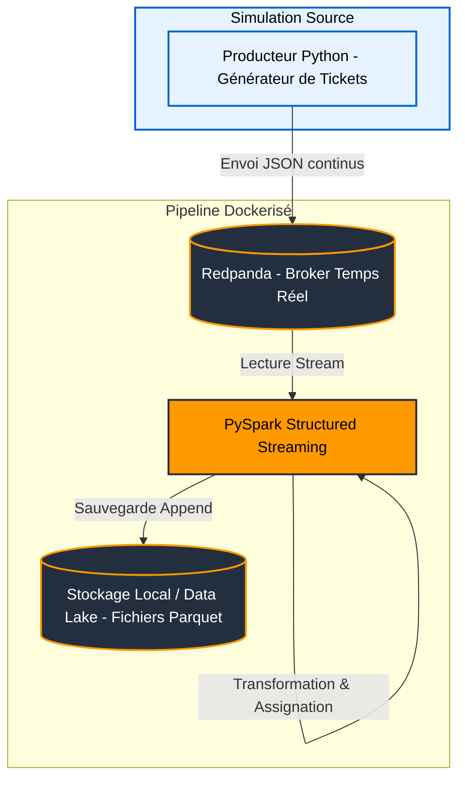

# POC : Pipeline temps réel de gestion des tickets clients (InduTech)

## Contexte du projet

Dans le cadre de la migration de l'entreprise **InduTech** vers le Cloud AWS, ce **POC (Proof of Concept)** démontre la faisabilité d'une architecture **event-driven** pour :

- l’ingestion de données  
- le traitement en temps réel  
- la sauvegarde de tickets de support client  

L’objectif est de simuler un pipeline moderne de type **Data Engineering / Streaming**.

---

## Architecture du pipeline

Voici l'architecture hybride implémentée et simulée pour ce POC :



---

## Stack technique

- Python (Producer)
- Redpanda (Kafka-like broker)
- PySpark Structured Streaming
- Docker & Docker Compose
- Stockage Parquet (Data Lake local)

---

## Comment lancer le projet ?

### Prérequis

- Docker
- Docker Compose

### Étapes

- Clonez ce dépôt.

```bash
git clone <url-du-repo>
```

- Mettez votre terminal à la racine du projet.

```bash
cd <nom-du-projet>
```

- Lancez l'orchestration complète avec la commande suivante :

```bash
docker-compose up --build
```

- Observez le POC fonctionner.

---

## Fonctionnement

1. Le Producer Python génère des tickets clients simulés (JSON)
2. Les données sont envoyées en continu vers Redpanda
3. PySpark Streaming consomme le flux :
   - transformation des données
   - enrichissement / assignation
4. Les résultats sont stockés en format Parquet

---

## Résultats

Les données transformées sont disponibles dans :

```
/output_data/tickets
```

Format : `.parquet`

---

## Démonstration vidéo

👉 Remplacer ce lien par la vidéo

---

## Objectifs du POC

- Valider une architecture temps réel
- Simuler un pipeline Data Engineer moderne
- Tester une approche event-driven
- Préparer une migration vers AWS

---

## Améliorations possibles

- Intégration AWS réelle (S3, Kinesis, MSK)
- Monitoring (Prometheus / Grafana)
- Gestion des erreurs / retry
- Ajout d’un schéma (Avro / Schema Registry)
- Dashboard temps réel (Streamlit / Superset)
